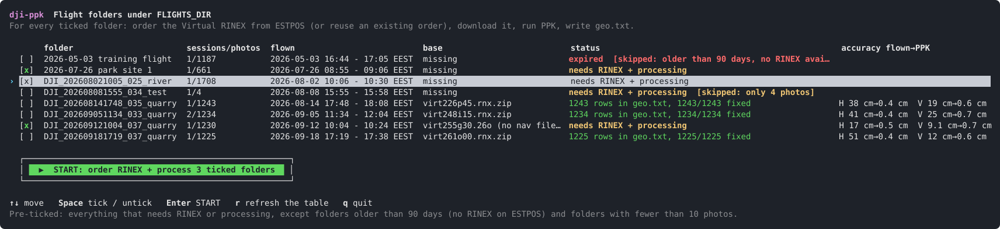

# dji-ppk

Post-processes DJI RTK drone flights (tested with a Matrice 4E and a D-RTK 3) against ESTPOS base data and writes
centimetre-accurate camera positions for photogrammetry (WebODM `geo.txt`). One command orders the base data from
the ESTPOS portal, downloads it, runs the PPK and reports how accurate the result is.

[ESTPOS](https://geoportaal.maaamet.ee/est/ruumiandmed/estpos-riiklik-gnss-satelliitandmete-keskus-p838.html) is the
Estonian national GNSS reference station network run by the Land Board (Maa-amet). Its portal
(https://gnss-rtk.maaamet.ee/sbc, free account) delivers **Virtual RINEX** files: base station observations computed
for any point you choose. This tool uses them as the base for post-processed kinematic (PPK) correction of the
drone's positions, replacing an on-site base or a real-time RTK link. Typical result on the test flights: the photo
positions as flown (D-RTK 3 surveyed by PPP) are off by 20-50 cm; after PPK RTKLIB estimates 4 mm horizontal and
6 mm vertical.

Engine: [RTKLIB-EX](https://github.com/rtklibexplorer/RTKLIB) `v2.5.1` (`rnx2rtkp`), running in Docker. Portal
automation: Playwright in a second container. Everything is driven from one Python launcher on the host.

## Quick start

```sh
git clone https://github.com/anton4/dji-ppk.git && cd dji-ppk
cp .env.example .env      # set FLIGHTS_DIR (the folder that holds the DJI flight folders) and ESTPOS_USER / ESTPOS_PASSWORD
./dji-ppk                 # builds the images on first use, then shows the table below
```

Needs `python3` and Docker with the compose plugin on the host, nothing else. Docker Desktop on macOS, Docker Engine
on Linux; the flights directory may be an external disk as long as Docker may share it.

## The launcher



`./dji-ppk` lists every flight folder under `FLIGHTS_DIR` with its sessions and photo count, when it was flown, which
base file it has, its status, and the accuracy before and after PPK once processed. Four keys:

| key | does |
|---|---|
| `↑` `↓` | move |
| `Space` | tick / untick a folder |
| `Enter` | **START**: for every ticked folder, order the Virtual RINEX (or reuse an order already on the portal), download it, run the PPK, write the results |
| `q` | quit (`r` refreshes the table) |

Pre-ticked: every folder that needs RINEX or processing, except flights older than ESTPOS's 90-day RINEX retention
(no base can be ordered any more) and folders with fewer than 10 photos. Skipped folders say why in the status column.

The status column reads `needs RINEX + processing`, `needs processing`, `needs reprocessing (inputs changed)`,
`waiting for photos`, `expired`, or the result: `1234 rows in geo.txt, 1234/1234 fixed`. Photos that did not reach a
fixed solution are listed in red (`172 float (not cm-accurate)`): their positions can be off by decimetres. The
accuracy column shows the typical horizontal (H) and vertical (V) photo position error as flown and RTKLIB's estimate
after PPK, for example `H 41 cm→0.4 cm  V 25 cm→0.7 cm`.

The launcher keeps itself current: on every start it fetches the git remote, pulls a newer version when the working
tree is clean, re-runs itself, and rebuilds an image that is older than the code before using it. `--no-update` or
`DJI_PPK_NO_UPDATE=1` skips that. Docker output is shown as is; a missing image is built with visible progress (the
RTKLIB compile takes a few minutes once).

### Command line

```sh
./dji-ppk status                 # the table without the menu (--json for scripts)
./dji-ppk <folder>               # START for one folder (same as ./dji-ppk run <folder>)
./dji-ppk run --all              # every folder the table would tick by default
./dji-ppk order <folder>         # order + download the Virtual RINEX only (--force to re-order, --dry-run to stop before Esita)
./dji-ppk download <folder>      # download an order that already exists on the portal (never orders)
./dji-ppk process <folder>       # PPK only, with whatever base file is in the folder
./dji-ppk window <folder>        # print the order parameters for ordering by hand
./dji-ppk watch                  # start the folder watcher and follow its log
./dji-ppk build                  # (re)build both images
```

`<folder>` is the folder name under `FLIGHTS_DIR` or any path to it. Extra arguments after the folder go to the
underlying `ppk` command (see below). Without a terminal (pipes, Windows) the menu falls back to a typed version.

## What START does for a folder

1. **Sessions.** A folder is one project. Battery swaps or a rain break give several OBS/NAV/MRK triplets, each with the
   photo index restarting at 0001. Photos are assigned to their session by the capture time in their file name.
2. **Base file.** If a base file in the folder already covers every session and comes with navigation files, nothing is
   ordered. Otherwise one Virtual RINEX order spanning all sessions plus a 5 min buffer is placed on the ESTPOS portal
   at the mean photo position (a flight day longer than 6 h is split at the gaps between sessions). If the portal already
   lists an order with the same project name, start and length, it is downloaded instead of re-ordered. The zip lands in
   the folder and is validated (RINEX version, interval, coverage, antenna in the IGS ANTEX, baseline).
3. **PPK.** For each session the rover `.OBS` is copied with one RINEX event record per exposure, `rnx2rtkp` runs with
   the base observations, the base navigation files and the rover NAV, and the event solutions are matched back to the
   MRK rows (±1.5 ms) with the DJI lever arm applied (camera = antenna + N, + E, height − V, as Emlid Studio does).
4. **Outputs**, merged over all sessions, written into the flight folder:

| file | content |
|---|---|
| `geo.txt` | WebODM/ODM geo file: `EPSG:4326`, then `<image> <lon> <lat> <ellipsoidal height>` per photo (camera position) |
| `events.csv` | per photo: image, GPST, camera lat/lon/h, Q, satellites, std, ratio, antenna lat/lon/h, MRK offsets, DJI RTK position |
| `summary.json` | counts, fix ratios, inputs, versions, RTKLIB standard deviations, on-board RTK vs PPK statistics, per-session summaries |
| `accuracy.txt` | the short table printed at the end of a run: typical and worst photo error as flown and after PPK, horizontal and vertical |
| `<session>_trajectory.pos`, `<session>_trajectory_events.pos` | RTKLIB antenna trajectory (5 Hz) and the solutions at the exposure times |
| `<session>_*` | per-session `events.csv`, `geo.txt`, `summary.json`, `accuracy.txt`, `rtklib.log`, `rtklib_used.conf` |
| `compare_report.txt` | only when an Emlid Studio `*_events.pos` is in the folder: photo-by-photo comparison |

Three reports are printed after each session: the solution quality (fix counts, satellites, RTKLIB's estimated
standard deviations, ambiguity ratio), the drone's on-board RTK positions from the `.MRK` compared with the PPK result
(the mean is the position error of the on-board base, for a PPP-surveyed D-RTK 3 usually decimetres; the scatter is
mostly the drone's motion between the RTK epoch and the exposure), and the one-table summary in centimetres.

Results are written next to the photos (`PPK_IN_PLACE=1`, the default). `PPK_IN_PLACE=0` writes to
`/data/out/<folder>/` instead. Processing takes 5-15 s per session.

## Status values

| `next` | meaning |
|---|---|
| `order` | no base file covers every session, or the base has no navigation files (see the NAV note below) |
| `process` | base present, no result yet |
| `reprocess` | an input file, the base or the photo set is newer than the result |
| `photos` | fewer photos in the folder than camera events in the MRK: the copy is not finished |
| `expired` | flown more than 90 days ago and no base file in the folder: ESTPOS has no RINEX for it any more |
| `done` | nothing to do |

Moving to another machine: put the flight folders under its `FLIGHTS_DIR`, set `.env`, START. Orders placed earlier
are found on the portal by project name and span and downloaded without re-ordering; the portal keeps prepared results
for 14 days and raw data for 90 days.

## Ordering from the ESTPOS portal

`ppk estpos-order` (the `order` step) runs in the `ppk-estpos` image and drives the portal's web UI, since ESTPOS has
no public API:

1. logs in with `ESTPOS_USER` / `ESTPOS_PASSWORD` from `.env` (that file is gitignored and never leaves the machine),
2. fills the *RINEX andmed* form: start on the quarter hour before the flight (Estonian time), length, the mean photo
   position as the Virtual RINEX point, the take-off ground height, 1 s rate, project name = folder name (30 characters,
   longer names get a short hash suffix so they stay unique),
3. **verifies before submitting**: the portal recomputes data availability after every change with the exact parameters
   it will send; the tool reads that request back and aborts if start, end, latitude, longitude, rate or project differ,
4. presses *Esita*, confirms *Kinnita*, polls *Tulemused* until the entry is ready (usually under two minutes), downloads
   the zip into the flight folder and validates it.

Outage handling: when the portal's backend (X-pos) is down, the tool stops after about 90 s with a clear message and
START stops the batch; orders the portal already accepted are reused on the next run. A timeout while waiting is reported
as "placed, not ready yet", also reused later. `--dry-run` fills and verifies the form, saves `estpos_order_form.png`
and does not submit.

## Watcher

```sh
./dji-ppk watch            # docker compose up -d ppk-watch && docker compose logs -f ppk-watch
```

Every `PPK_POLL_SECONDS` the watcher scans `FLIGHTS_DIR` for flight folders. A folder is processed once its files are
stable and a base file with navigation files covers every session; results are newer than all inputs afterwards, so it
is left alone until something changes. The watcher never orders from the portal on its own.

## Accuracy and engine settings

Reference flight: 20 min, 5 Hz, 1230 photos, ESTPOS Virtual RINEX 130 m from the site, compared with Emlid Studio 1.10
(1229/1230 photos fixed). The comparison report is in `examples/reference-result/`. Emlid was fed the DJI `.NAV` only,
so its reference is a Galileo-only solution (see the NAV note); rows with base navigation files therefore differ more
from Emlid while using three times as many satellites.

| configuration | photos fixed | trajectory fixed | median 3D vs Emlid |
|---|---|---|---|
| `dji_m4e.conf` (L1+L2+L5, GPS+SBAS+Galileo+QZSS+BeiDou, base PCO+PCV, base navigation files) **default** | 1230/1230 | 100 % | 12.2 mm; RTKLIB std 3.5 mm horizontal, 5.6 mm vertical, 19-23 satellites |
| same, DJI NAV only (no GPS, no BeiDou: Galileo on 4-7 satellites, like Emlid) | 1230/1230 | 99.6 % | 5.8 mm (1.5 mm horizontal, 5.7 mm vertical) |
| default + `--set pos1-posopt2=off` (PCO only) | 1230/1230 | 99.5 % | 2.1 mm |
| `dji_m4e_l1l2.conf` (L1+L2) | 1230/1230 | 100 % | 14.1 mm (vertical) |
| RTKLIB-EX `main` @ `06e86442` (2026-08-31), same conf | 1230/1230 | 99.0 % | 5.8 mm (photo positions equal to v2.5.1 within 0.5 mm) |
| `--set pos1-navsys=27` (GPS+Galileo only, the default before 2026-09-21) | 1230/1230 | 100 % | 11.6 mm; photo positions within 2.8 mm median of the BeiDou default |
| GLONASS added, `pos2-gloarmode=autocal` | 0 | 0 % | never fixes: DJI vs Leica inter-channel biases |
| GLONASS added as float only (`pos1-navsys=31`) | 1230/1230 | 100 % | 11.5 mm, but the 2026-09-18 flight drops to 1141/1225 fixed |
| `--set pos1-frequency=l1+l2+l5+l6` (Galileo E6 + BeiDou B3I) | 1230/1230 | 99.3 % | 37 mm shift, std 4.5/7.1 mm; the 2026-09-18 flight gets 0 % fixed |
| `--set misc-timeinterp=on` | 0 | – | RTKLIB writes no event solutions |

RTKLIB is built with four carrier frequency slots (`RTKLIB_NFREQ=4`) so the fourth can be tried; the default stays
three. `RTKLIB_REF` selects the RTKLIB-EX tag or branch. The 76 commits on `main` after v2.5.1 (checked 2026-09-21)
only touch the solver for urban-canyon use and give the same photo positions within 0.5 mm, so `v2.5.1` stays the
default; `config/dji_m4e_main.conf` holds the satellite-count thresholds that branch needs.

The "after PPK" figures are RTKLIB's own estimates and are not verified against ground control points; independent
checks of such setups typically show 1-3 cm. Surveying your own control points is possible with the D-RTK 3 as a static
logger against a Virtual RINEX, but is not implemented here.

## Notes and pitfalls

- **DJI `.NAV` files carry GPS ephemerides dated 1024 weeks early** (2007 instead of 2026, the GPS week rollover bug).
  RTKLIB silently ignores them, so with the rover NAV alone GPS satellites are not used at all. The tool therefore
  requires the base **with its navigation files**, which the ESTPOS zip contains (`.26n/.26g/.26l/.26f`); a plain
  `.26o` downloaded by hand is treated as insufficient and the zip is ordered. A warning names the constellations whose
  rover ephemerides are unusable.
- GLONASS stays off: its frequency-division signals carry receiver-specific biases that RTKLIB cannot calibrate between
  the DJI receiver and the Leica base; it never fixes and as float-only it lowers the fix rate.
- GPS L5, Galileo E5a/E5b and E1 use different tracking codes on the DJI (I, B) and Leica (Q, C) receivers; RTKLIB-EX
  resolves ambiguities fine anyway.
- Time zones: DJI folder names and the ESTPOS order form use Estonian time, so order texts and time spans lead with
  Estonian time (`TZ`, default `Europe/Tallinn`) and give GPST (UTC + 18 s) in parentheses. RTKLIB output files and
  `events.csv` are GPST.
- The height of the Virtual RINEX point (take-off ground height from the first photo's XMP) does not affect the result:
  the synthesized observations and the file header move together.
- Base files may be `.??o`, RINEX 3 long names (`.rnx`), Hatanaka (`.crx`, `.??d`), `.gz`, `.Z` or `.zip`.
- The `.trace` files that Emlid Studio leaves in flight folders can be gigabytes; nothing in the flight folder is copied
  except the `.OBS` (with events) into a temporary `work/` directory. Emlid `*_events.pos` files are used as comparison
  references; the tool's own `*_trajectory_events.pos` never is.
- Logs are colored on a terminal (the launcher passes `PPK_COLOR=1`; `NO_COLOR=1` disables it). Files on disk stay plain.

## Layout

```
dji-ppk              host launcher (python3, stdlib): table + START, run / status / order / download / process, self-update
Dockerfile           processing image: RTKLIB-EX (rnx2rtkp, convbin, pos2kml), crx2rnx, IGS ANTEX, python package
Dockerfile.estpos    portal image: Playwright + Chromium + python package (ordering / downloading Virtual RINEX)
compose.yaml         services ppk (one-shot CLI), ppk-estpos (portal), both profile "cli", and ppk-watch
.env.example         FLIGHTS_DIR, ESTPOS_USER / ESTPOS_PASSWORD, PPK_IN_PLACE, PPK_POLL_SECONDS, RTKLIB_REF, RTKLIB_NFREQ
config/dji_m4e.conf  RTKLIB options (three frequencies, GPS+SBAS+Galileo+QZSS+BeiDou, fix-and-hold, combined filter)
config/dji_m4e_l1l2.conf  two-frequency variant;  config/dji_m4e_main.conf  variant for RTKLIB-EX main
ppk/                 python package `ppk` (stdlib only): cli, discover, mrk, rinex, events, rtklib, outputs, compare,
                     estpos, estpos_web (Playwright), status, watch, ui, tests
examples/            reference comparison report for the flight above
docs/                the table screenshot used above
```

Inside the containers the flights directory is mounted at `/data/flights` (read-write), `/data/base` (optional extra
base files, read-only) and `/data/out` (only with `PPK_IN_PLACE=0`).

<details>
<summary>The underlying ppk commands</summary>

```sh
docker compose --profile cli run --rm ppk status /data/flights [--json]
docker compose --profile cli run --rm ppk process /data/flights/<folder> [--conf f] [--set k=v] [--geo-accuracy] [--fixed-only] [--keep-work] [--no-in-place --out-dir /data/out --name x]
docker compose --profile cli run --rm ppk estpos-window /data/flights/<folder>
docker compose --profile cli run --rm ppk check-base /data/flights/<folder>/<zip> --flight /data/flights/<folder>
docker compose --profile cli run --rm ppk compare /data/flights/<folder> "/data/flights/<folder>/<name>_events.pos"
docker compose --profile cli run --rm ppk-estpos estpos-order /data/flights/<folder> [--dry-run] [--force] [--no-wait] [--timeout min] [--project name] [--rate s] [--max-hours h]
docker compose --profile cli run --rm ppk-estpos estpos-download /data/flights/<folder> [--project name] [--timeout min]
```

Ordering by hand instead: https://gnss-rtk.maaamet.ee/sbc, Järeltöötlemine → RINEX andmed → tick "Virtuaalne RINEX",
enter the values `./dji-ppk window <folder>` prints, Esita, Kinnita, then Tulemused → Lae alla, and copy the zip into the
flight folder.
</details>

## Development

```sh
cd ppk && PYTEST_DISABLE_PLUGIN_AUTOLOAD=1 python3 -m pytest tests      # host, no dependencies
docker compose --profile cli run --rm --entrypoint pytest ppk /app/ppk/tests   # in the image
docker compose --profile cli build --build-arg RTKLIB_REF=main ppk       # another RTKLIB-EX tag or branch
```

The test fixtures are excerpts of real DJI and ESTPOS files with coordinates shifted by a few hundred metres and the
raw observations perturbed, so they exercise the parsers but cannot be used for positioning. `docs/table.svg` is
rendered from the launcher with made-up folder names.

## License

MIT, see `LICENSE`. The Docker images build and bundle third-party software under its own terms:

- [RTKLIB-EX](https://github.com/rtklibexplorer/RTKLIB) (`rnx2rtkp`, `convbin`, `pos2kml`), BSD-2-Clause, Copyright T. Takasu and rtklibexplorer
- [RNXCMP](https://terras.gsi.go.jp/ja/crx2rnx.html) (`crx2rnx`), Geospatial Information Authority of Japan, redistributable with attribution
- [IGS ANTEX](https://files.igs.org/pub/station/general/) `igs20.atx`, antenna calibration data from the International GNSS Service
- [Playwright](https://playwright.dev) and Chromium in the portal image, Apache-2.0 / BSD
