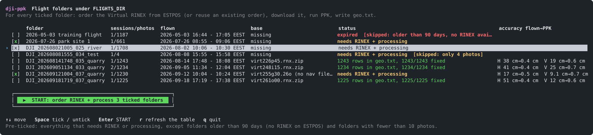

# dji-ppk

Post-processes DJI RTK drone flights against Estonia's ESTPOS reference network and writes centimetre-accurate camera
positions for photogrammetry (a WebODM `geo.txt`). One command orders the base data, downloads it, runs the PPK and
tells you how accurate the photos are. Tested with a DJI Matrice 4E and a D-RTK 3 base station.

Typical result on the test flights: the photo positions as flown (D-RTK 3 calibrated by PPP) are off by 20–50 cm;
after PPK they are at the 1–3 cm level (RTKLIB estimates 4 mm horizontal, 6 mm vertical).

**Contents:** [How it works](#how-it-works) · [Quick start](#quick-start) · [Using the launcher](#using-the-launcher) ·
[What a run does](#what-a-run-does) · [Accuracy](#accuracy) · [Known base point](#known-base-point-survey-the-d-rtk-3-once-fly-without-ppk) ·
[ESTPOS ordering](#ordering-from-the-estpos-portal) · [Watcher](#watcher) · [Updates](#updates) ·
[Notes and pitfalls](#notes-and-pitfalls) · [Reference](#reference)

## How it works

```
DJI flight folder          ESTPOS portal                 RTKLIB-EX (Docker)            WebODM
photos + .OBS/.NAV/.MRK -> Virtual RINEX for the site -> PPK at every exposure     -> geo.txt next to the photos
                           (ordered automatically)       camera = antenna + lever arm  reports in ppk/
```

- **[ESTPOS](https://geoportaal.maaamet.ee/est/ruumiandmed/estpos-riiklik-gnss-satelliitandmete-keskus-p838.html)** is
  the Estonian national GNSS reference network run by the Land Board (Maa-amet). Its portal
  (https://gnss-rtk.maaamet.ee/sbc, free account) delivers **Virtual RINEX** files: base station observations computed
  for any point you choose. They replace an on-site base or a real-time RTK link.
- **Engine:** [RTKLIB-EX](https://github.com/rtklibexplorer/RTKLIB) `v2.5.1` (`rnx2rtkp`) in a Docker image; the
  portal is driven by Playwright in a second image. Everything is started from one Python launcher on the host.

## Quick start

Needs `python3` and Docker with the compose plugin, nothing else: Docker Desktop on macOS, Docker Engine on Linux. The
flights directory may be an external disk as long as Docker may share it.

```sh
git clone https://github.com/anton4/dji-ppk.git && cd dji-ppk
cp .env.example .env      # set FLIGHTS_DIR and ESTPOS_USER / ESTPOS_PASSWORD
./dji-ppk                 # builds the images on first use (RTKLIB compiles for a few minutes once), then shows the table
```

### Settings

In `.env` (gitignored, never leaves the machine):

| variable | default | meaning |
|---|---|---|
| `FLIGHTS_DIR` | `.` | folder that holds the DJI flight folders (mounted read-write at `/data/flights`) |
| `ESTPOS_USER`, `ESTPOS_PASSWORD` | – | ESTPOS portal account, needed to order Virtual RINEX |
| `BASE_DIR` | `./data/base` | extra base RINEX files (mounted read-only at `/data/base`) |
| `PPK_IN_PLACE` | `1` | `1`: results go into the flight folder; `0`: into `OUT_DIR/<folder>/` |
| `OUT_DIR` | `./data/out` | only with `PPK_IN_PLACE=0` (mounted at `/data/out`) |
| `PPK_POLL_SECONDS` | `30` | how often the watcher scans |
| `RTKLIB_REF` | `v2.5.1` | RTKLIB-EX tag or branch to build |
| `RTKLIB_NFREQ` | `4` | carrier frequency slots compiled into RTKLIB (4 allows `l1+l2+l5+l6`; 3 is upstream's default) |

Environment switches for the launcher: `DJI_PPK_NO_UPDATE=1` (no self-update), `DJI_PPK_NO_VERSION_CHECK=1` (no
upgrade check), `NO_COLOR=1` (no colors). Time zone for reports: `TZ` / `PPK_TZ`, default `Europe/Tallinn`.

## Using the launcher



`./dji-ppk` lists every flight folder under `FLIGHTS_DIR`: sessions and photo count, when it was flown, which base file
it has, its status, and the accuracy before and after PPK once processed.

| key | does |
|---|---|
| `↑` `↓` | move |
| `Space` | tick / untick a folder |
| `Enter` | **START**: for every ticked folder, order the Virtual RINEX (or reuse an order already on the portal), download it, run the PPK, write the results |
| `r` | refresh the table |
| `q` | quit |

Without a terminal (pipes, Windows) the menu falls back to a typed version.

### Which folders are ticked

- **Newest flight first**, and the cursor starts on it.
- **Pre-ticked:** every folder that needs RINEX or processing, except flights older than ESTPOS's 90-day RINEX
  retention and folders with fewer than 10 photos. Skipped folders say why in the status column.
- **Your choices are remembered:** a pre-ticked folder you untick stays unticked next time
  (`[skipped: unticked by you (remembered)]`), and `./dji-ppk run --all` leaves it out too, until you tick it again.
  The list is kept per machine in `.excluded-folders.json` (gitignored); the watcher does not use it.
- **Folders that can never be processed** (`no-times`, below) are listed last, dimmed, shown as `[-]` and cannot be
  ticked.

### Status

| next step | status column | meaning |
|---|---|---|
| `order` | needs RINEX + processing | no base file covers every session, or the base has no navigation files ([why](#notes-and-pitfalls)) |
| `process` | needs processing | base present, no result yet |
| `reprocess` | needs reprocessing (inputs changed) | an input file, the base or the photo set is newer than the result, or the folder still has the old layout (reports next to the photos) |
| `photos` | waiting for photos | fewer photos in the folder than camera events in the MRK: the copy is not finished |
| `expired` | expired | flown more than 90 days ago and no base file in the folder: ESTPOS has no RINEX for it any more |
| `survey` | base point: needs RINEX + static survey | a D-RTK 3 base point folder, see [Known base point](#known-base-point-survey-the-d-rtk-3-once-fly-without-ppk) |
| `no-times` | MRK has no exposure times … | DJI wrote no exposure times into the `.MRK` (e.g. TOW −259200 in week −522 on every row). The photos cannot be placed on the PPK trajectory, so nothing is ordered or processed; only the on-board RTK positions in the photos are usable |
| `done` | `1234 rows in geo.txt, 1234/1234 fixed` | nothing to do |

Photos that did not reach a fixed solution are shown in red (`172 float (not cm-accurate)`): their positions can be off
by decimetres.

The **accuracy** column shows the typical horizontal (H) and vertical (V) photo error as flown and RTKLIB's estimate
after PPK, e.g. `H 41 cm→0.4 cm  V 25 cm→0.7 cm`; see [Accuracy](#accuracy).

### Command line

```sh
./dji-ppk status                 # the table without the menu (--json for scripts)
./dji-ppk <folder>               # START for one folder (same as ./dji-ppk run <folder>)
./dji-ppk run --all              # every folder the table would tick
./dji-ppk order <folder>         # order + download the Virtual RINEX only (--force to re-order, --dry-run to stop before Esita)
./dji-ppk download <folder>      # download an order that already exists on the portal (never orders)
./dji-ppk process <folder>       # PPK only, with whatever base file is in the folder
./dji-ppk window <folder>        # print the order parameters for ordering by hand
./dji-ppk survey <folder>        # survey a D-RTK 3 base point folder; START does it for such folders too
./dji-ppk watch                  # start the folder watcher and follow its log
./dji-ppk build [--fresh]        # (re)build both images; --fresh without the Docker cache
```

`<folder>` is the folder name under `FLIGHTS_DIR` or any path to it. Extra arguments after the folder go to the
underlying `ppk` command ([Reference](#reference)).

## What a run does

1. **Sessions.** A folder is one project. Battery swaps or a rain break give several OBS/NAV/MRK triplets, each with
   the photo index restarting at 0001; photos are assigned to their session by the capture time in their file name.
2. **Base file.** If a base file in the folder already covers every session and comes with navigation files, nothing is
   ordered. Otherwise one Virtual RINEX order spanning all sessions plus 5 min is placed at the mean photo position (a
   flight day longer than 6 h is split at the gaps between sessions) and validated after download: RINEX version,
   interval, coverage, antenna in the IGS ANTEX, baseline. Details in [Ordering](#ordering-from-the-estpos-portal).
3. **PPK.** For each session the rover `.OBS` is copied with one RINEX event record per exposure, `rnx2rtkp` runs with
   the base observations, the base navigation files and the rover NAV, and the event solutions are matched back to the
   MRK rows (±1.5 ms) with the DJI lever arm applied (camera = antenna + N, + E, height − V, as Emlid Studio does).
4. **Outputs**, merged over all sessions. Processing takes 5–15 s per session.

### Outputs

```
DJI_202610021701_041_site/
├── DJI_..._V.JPG, DJI_..._D.OBS/.NAV/.MRK, virt….zip   inputs
├── geo.txt                                             for WebODM: the only result next to the photos
└── ppk/                                                everything else
    ├── accuracy.txt  processing.log  summary.json  events.csv
    └── <session>_trajectory.pos  <session>_trajectory_events.pos  rtklib.log  rtklib_used.conf
```

| file | content |
|---|---|
| `geo.txt` | WebODM/ODM geo file: `EPSG:4326`, then `<image> <lon> <lat> <ellipsoidal height>` per photo (camera position) |
| `ppk/accuracy.txt` | the short table printed at the end of a run: typical and worst photo error as flown and after PPK |
| `ppk/processing.log` | the whole console output of the run (steps, warnings, all reports), plain text without colors |
| `ppk/summary.json` | counts, fix ratios, inputs, versions, RTKLIB standard deviations, on-board RTK vs PPK statistics, per-session summaries |
| `ppk/events.csv` | per photo: image, GPST, camera lat/lon/h, Q, satellites, std, ratio, antenna lat/lon/h, MRK offsets, DJI RTK position |
| `ppk/<session>_trajectory.pos`, `…_trajectory_events.pos` | RTKLIB antenna trajectory (5 Hz) and the solutions at the exposure times |
| `ppk/<session>_*` | several sessions only: per-session `events.csv`, `geo.txt`, `summary.json`, `accuracy.txt`, `rtklib.log`, `rtklib_used.conf` |
| `ppk/compare_report.txt` | only when an Emlid Studio `*_events.pos` is in the folder: photo-by-photo comparison |

With `PPK_IN_PLACE=0` the same layout is written to `/data/out/<folder>/` instead.

### Using the results in WebODM

- **Upload the photos and `geo.txt` together.** WebODM (NodeODM) takes every uploaded `.txt` other than `geo.txt` and
  `image_groups.txt` for a GCP file, which is why all other outputs live in `ppk/`. Folders processed by an older
  version, with the reports next to the photos, show as `reprocess`; processing them again removes the old copies.
- **Coordinate frame:** EUREF-EST97 (Estonia's ETRS89, the frame of L-EST97 and the cadastre), inherited from the
  ESTPOS base. `geo.txt` says `EPSG:4326` on purpose: ODM/PROJ applies no datum shift between the two, so the model's
  "WGS84 UTM 35N" is numerically ETRS89 / UTM 35N (EPSG:25835) and lines up with the cadastre at the centimetre level.
- **Against Google or Esri imagery** (WGS84/ITRF) the model sits 0.5–0.9 m off, growing ~2.5 cm a year with the
  plate motion. That is expected, not an error; no drift correction is applied.
- **Heights** are GRS80 ellipsoidal. EH2000 heights need the EST-GEOID2017 separation (about 17–25 m), which is not
  applied here.

## Accuracy

### Reading the reports

Three reports are printed after each session (and kept in `ppk/processing.log`):

1. **Solution quality:** fix counts, satellites, RTKLIB's estimated standard deviations, ambiguity ratio.
2. **On-board RTK vs PPK:** the positions the drone wrote during the flight (`.MRK`) against the PPK result.
   - The **mean** is one constant shift for the whole flight: how far the on-board RTK base was off. For a D-RTK 3
     calibrated by PPP that is typically decimetres.
   - The **scatter** around it is split into the part along and across the flight direction and fitted as a **timing
     lag** of the MRK positions (a real photo error that grows with speed; only PPK removes it) and a **camera
     offset** factor (near 1: the MRK holds the camera position rather than the antenna's, so that part is no photo
     error at all). What is left is the RTK noise.
3. **In short:** one table in centimetres, as flown vs after PPK, also saved as `ppk/accuracy.txt`.

"1 sigma" is one standard deviation: about 68 % of values lie within ±1σ, 95 % within ±2σ. A sigma says how much
values scatter, not whether they are all shifted: the accuracy a D-RTK 3 shows after PPP calibration is such a
precision estimate and says nothing about its constant offset, which is why the measured shift above can be much
larger.

### Comparing the ways to fly

| | As flown: D-RTK 3 calibrated by PPP | Known base point, no PPK | D-RTK 3 calibrated by PPP + RINEX PPK |
|---|---|---|---|
| **Setup on site** | PPP calibration, ~20–25 min to settle | station on the marked point, pick the saved coordinate: minutes | PPP calibration (its accuracy does not matter) |
| **Work after the flight** | none | none | order the Virtual RINEX and process: START, a few minutes |
| **Base position error** | 30–40 cm, one shift for the whole flight | survey ~1–2 cm + re-setup over the marker ~1 cm | removed by PPK |
| **Per photo, horizontal** | base error + on-board scatter | on-board scatter: ~2–3 cm, or ~15–20 cm if it is a timing lag (the report tells) | ~1–3 cm |
| **Per photo, vertical** | base error (~15 cm) + ~1–2 cm | ~2–3 cm | ~1–3 cm |
| **Example 2026-10-02**, 1231 photos | 40 cm H / 15 cm V (rms) | depends on what the 17 cm scatter is | RTKLIB estimate 0.4 cm H / 0.6 cm V (1σ) |
| **Good for** | quick looks | repeat visits, once one PPK run has shown no timing lag | survey-grade models, anything compared with the cadastre |

The PPK figures are RTKLIB's own estimates, not verified against ground control points; independent checks of such
setups typically show 1–3 cm. Surveying your own control points is possible with the D-RTK 3 as a static logger
against a Virtual RINEX, but is not implemented here.

### Reference flight and engine settings

Reference flight: 20 min, 5 Hz, 1230 photos, ESTPOS Virtual RINEX 130 m from the site, compared with Emlid Studio 1.10
(1229/1230 photos fixed); the report is in [`examples/reference-result/`](examples/reference-result/). Emlid was fed
the DJI `.NAV` only, so its reference is a Galileo-only solution ([NAV note](#notes-and-pitfalls)); rows with base
navigation files therefore differ more from Emlid while using three times as many satellites.

| configuration | photos fixed | trajectory fixed | median 3D vs Emlid |
|---|---|---|---|
| `dji_m4e.conf` (L1+L2+L5, GPS+SBAS+Galileo+QZSS+BeiDou, base PCO+PCV, base navigation files) **default** | 1230/1230 | 100 % | 12.2 mm; RTKLIB std 3.5 mm horizontal, 5.6 mm vertical, 19–23 satellites |
| same, DJI NAV only (no GPS, no BeiDou: Galileo on 4–7 satellites, like Emlid) | 1230/1230 | 99.6 % | 5.8 mm (1.5 mm horizontal, 5.7 mm vertical) |
| default + `--set pos1-posopt2=off` (PCO only) | 1230/1230 | 99.5 % | 2.1 mm |
| `dji_m4e_l1l2.conf` (L1+L2) | 1230/1230 | 100 % | 14.1 mm (vertical) |
| RTKLIB-EX `main` @ `06e86442` (2026-08-31), same conf | 1230/1230 | 99.0 % | 5.8 mm (photo positions equal to v2.5.1 within 0.5 mm) |
| `--set pos1-navsys=27` (GPS+Galileo only, the default before 2026-09-21) | 1230/1230 | 100 % | 11.6 mm; photo positions within 2.8 mm median of the BeiDou default |
| GLONASS added, `pos2-gloarmode=autocal` | 0 | 0 % | never fixes: DJI vs Leica inter-channel biases |
| GLONASS added as float only (`pos1-navsys=31`) | 1230/1230 | 100 % | 11.5 mm, but the 2026-09-18 flight drops to 1141/1225 fixed |
| `--set pos1-frequency=l1+l2+l5+l6` (Galileo E6 + BeiDou B3I) | 1230/1230 | 99.3 % | 37 mm shift, std 4.5/7.1 mm; the 2026-09-18 flight gets 0 % fixed |
| `--set misc-timeinterp=on` | 0 | – | RTKLIB writes no event solutions |

RTKLIB is built with four carrier frequency slots (`RTKLIB_NFREQ=4`) so the fourth can be tried; the default stays
three. The 76 commits on `main` after v2.5.1 (checked 2026-09-21) only touch the solver for urban-canyon use and give
the same photo positions within 0.5 mm, so `v2.5.1` stays the default; `config/dji_m4e_main.conf` holds the
satellite-count thresholds that branch needs.

## Known base point: survey the D-RTK 3 once, fly without PPK

A D-RTK 3 calibrated by PPP takes 20 min to converge and still sits 30–40 cm from the truth, which is exactly the
offset PPK removes from every flight. For a site you return to, survey the station's position once instead: enter the
result in DJI Pilot 2 as a Manual Calibration, save it as a Frequent Coordinate, and from then on set the station up on
the same marker, pick the saved point and fly. The on-board RTK is then in EUREF-EST97 from the first minute and
RINEX + PPK become optional; how accurate that is depends on the drone, see
[Comparing the ways to fly](#comparing-the-ways-to-fly).

### Once per site

1. **Mark the point** (nail, paint): the coordinates belong to that spot to the centimetre. Set the station up plumb
   over it, calibrate as usual (PPP or network RTK), **write down the coordinates and the pole height Pilot 2 shows**,
   fly. Forgotten? The survey still gives the corrected antenna position; note them at the next calibration on the
   same marker and rerun with `--shown` and `--pole`, no new survey needed.
2. **Copy the station's logs.** Connect the D-RTK 3 over USB-C and copy that day's `DRTK3_*` files (OBS, NAV, MRK, and
   the `.dat` if you like) into a folder of their own, either directly under `FLIGHTS_DIR`
   (`FLIGHTS_DIR/yard-basepoint/`) or inside that day's flight folder (`FLIGHTS_DIR/DJI_..._040_yard/d-rtk3/`). Any
   folder with the station's logs and no drone flight is a base point. Inside a flight folder it reuses the flight's
   Virtual RINEX when that covers the session, and the flight's own result is the cross-check. Use the long session
   recorded after the calibration settled, not the two-minute one written during it; sessions under 10 min are listed
   but not surveyed.
3. **Survey.** `./dji-ppk` shows the folder with `survey` as its next step. START (or `./dji-ppk survey yard-basepoint`)
   asks once for the pole height and the shown coordinates, orders the Virtual RINEX at the broadcast position, runs
   the static solution and writes `basepoint.txt` with the block to type into Pilot 2:

```
 Calibration log DRTK3_0039_20260918093003_8PHDN9B00AG8UN.MRK: 2026-09-18 12:30 - 13:15 EEST, 551 rows, Q 255x16, 295x1
   held position: 59.43712345  24.75345678  47.812 m, reached after 23 min, 257 positions held in all
 Session DRTK3_0041_20260918095306_8PHDN9B00AG8UN: 2026-09-18 12:53 - 14:02 EEST, base yard-basepoint_VRNX.zip
   [PASS] 5460 fixed epochs (100.0 %), spread 1.1 / 0.9 / 2.4 mm N/E/U (1 sigma)
   broadcast (RTCM 1005, what the station used):  59.43712345  24.75345678  47.812 m
   surveyed  (static vs ESTPOS Virtual RINEX):     59.43712711  24.75345301  47.508 m
   correction surveyed - broadcast: +407 mm N, -213 mm E, -304 mm up  = 45.9 cm horizontal, -30.4 cm up
 Cross-check, flight DJI_202609181240_001 (drone on-board RTK vs PPK): +401 mm N, -220 mm E, -298 mm up -> [PASS] differs by 1.1 cm
 Phase centre above the pole tip implied by the data (h_broadcast - h_shown - pole): 0.142 m  (plausible)

 Enter in DJI Pilot 2 -> RTK -> D-RTK 3 -> Advanced Settings -> Adjust Coordinates (Manual Calibration),
 then save it as a Frequent Coordinate:
   Latitude            59.43712711
   Longitude           24.75345301
   Ellipsoidal height  45.566 m
   Pole height         1.800 m
```

### Every later visit

Same marker, same pole height, Manual Calibration with the saved Frequent Coordinate, fly. Process the first such
flight once with the normal pipeline: its "RTK base offset" should now be within 2–3 cm of zero, and its scatter
analysis shows what flying without PPK gives on your drone. Re-survey only when the marker or the pole changes; a
second log of the same point is reported next to the first.

<details>
<summary>Which correction is applied</summary>

The survey's correction (static solution minus broadcast position) puts the antenna on its true phase centre as
RTKLIB sees the station's antenna without a model. The drone-derived correction (the mean on-board-RTK-vs-PPK offset
of a same-day flight) is what makes the drone's RTK agree with the PPK result, and it absorbs the antenna modelling
differences between DJI's RTK chain and RTKLIB.

On the first real survey (2026-09-27, two sessions 2 and 22 min long, surveyed positions 5 mm apart although the
station had broadcast positions 2.4 m apart) the two corrections agreed to 1.2 cm horizontally but differed by 8.7 cm
in height. Since the point exists to make the drone's RTK right, the drone-derived correction is applied when a
processed same-day flight exists and its horizontal part agrees with the survey within 3 cm; the survey is then the
independent check. `--correction survey` or `flight` forces one. Both are in the report and in `basepoint.json`.
</details>

<details>
<summary>How the survey works, verified facts and open questions</summary>

In base mode the D-RTK 3 keeps its own logs on its internal storage, per session
`DRTK3_<seq>_<time>_<serial>.OBS/.NAV` (RINEX 3.05, 1 Hz, five constellations), `.dat` (the same as RTCM 3.2, what the
drone received) and `.MRK` (its position every 5 s during the calibration). The OBS header carries the position the
station broadcast (RTCM 1006: DJI's own antenna phase-centre coordinate for that session). A static `rnx2rtkp` run of
that OBS against an ESTPOS Virtual RINEX generated at that position gives the true phase centre. The difference is the
calibration error of the session; added to the coordinates Pilot 2 displayed after the calibration it gives the
corrected ground point, with the same pole height. The same-day flight's "RTK base offset" sees the same error from
the drone and is printed as a cross-check.

Verified on real files:

- the OBS header position equals the RTCM 1006 position in the `.dat` to 0.3 mm;
- the `.MRK` is the PPP convergence log: single for 30 s, then a held position that keeps moving for about 23 min
  before it settles; a session recorded before that inherits the unsettled position;
- the DJI Assistant 2 "log export" is an encrypted diagnostics bundle without GNSS data.

Still open: whether Pilot 2 displays the ground point or the antenna. The "phase centre above the pole tip" line
should be a stable value of roughly 0.1–0.2 m, and reads "the app shows the antenna" otherwise. The shown coordinates
may come from any calibration on the same marker, also a later one: the tool pairs them with the session whose
broadcast position is nearest, derives the phase-centre offset `k` from that pair and remembers it, so later surveys
need only the pole height.

Also: a `.dat` without its OBS is converted with `convbin` (`<session>_convbin.log`); the 90-day ESTPOS retention
applies to the session's date like to a flight; the ESTPOS portal's own computation service (Järeltöötlemine →
Arvutamine: upload the OBS, get EUREF-EST97 coordinates) is an independent check.
</details>

## Ordering from the ESTPOS portal

ESTPOS has no public API, so `ppk estpos-order` (the `order` step) drives the portal's web UI from the `ppk-estpos`
image:

1. logs in with `ESTPOS_USER` / `ESTPOS_PASSWORD` from `.env`;
2. fills the *RINEX andmed* form: start on the quarter hour before the flight (Estonian time), length, the mean photo
   position as the Virtual RINEX point, the take-off ground height, 1 s rate, project name = folder name (30
   characters; longer names get a short hash suffix so they stay unique);
3. **verifies before submitting:** the portal recomputes data availability after every change with the exact
   parameters it will send; the tool reads that request back and aborts if start, end, latitude, longitude, rate or
   project differ;
4. presses *Esita*, confirms *Kinnita*, polls *Tulemused* until the entry is ready (usually under two minutes),
   downloads the zip into the flight folder and validates it.

- **Reuse:** if the portal already lists an order with the same project name, start and length, it is downloaded
  instead of re-ordered. The portal keeps prepared results for 14 days and raw data for 90 days.
- **Outages:** when the portal's backend (X-pos) is down, the tool stops after about 90 s with a clear message and
  START stops the batch; orders the portal already accepted are reused on the next run. A timeout while waiting is
  reported as "placed, not ready yet" and also reused later.
- **`--dry-run`** fills and verifies the form, saves `estpos_order_form.png` and does not submit.
- **Moving to another machine:** put the flight folders under its `FLIGHTS_DIR`, set `.env`, START. Orders placed
  earlier are found on the portal and downloaded without re-ordering.
- **Ordering by hand:** https://gnss-rtk.maaamet.ee/sbc, Järeltöötlemine → RINEX andmed → tick "Virtuaalne RINEX",
  enter the values `./dji-ppk window <folder>` prints, Esita, Kinnita, then Tulemused → Lae alla, and copy the zip into
  the flight folder.

## Watcher

```sh
./dji-ppk watch            # docker compose up -d ppk-watch && docker compose logs -f ppk-watch
```

Every `PPK_POLL_SECONDS` the watcher scans `FLIGHTS_DIR`. A folder is processed once its files are stable and a base
file with navigation files covers every session; afterwards the results are newer than all inputs, so it is left alone
until something changes. The watcher never orders from the portal on its own.

## Updates

- **Self-update:** on every start the launcher fetches the git remote, pulls a newer version when the working tree is
  clean, re-runs itself, and rebuilds an image that is older than the code before using it. `--no-update` or
  `DJI_PPK_NO_UPDATE=1` skips that.
- **Upgrade check:** once a day (cached in `.version-check.json`) it checks whether the components the images are
  built from have a newer release, and prints only those, with the current and the new version and what to change.
  Nothing is upgraded automatically; offline it prints nothing; `DJI_PPK_NO_VERSION_CHECK=1` turns it off.

| component | compared with |
|---|---|
| RTKLIB-EX | latest GitHub release vs `RTKLIB_REF` |
| Playwright | PyPI vs the `Dockerfile.estpos` image tag |
| RNXCMP (`crx2rnx`) | GSI download page vs `Dockerfile` |
| Python, Debian base images | endoflife.date vs `Dockerfile` |
| IGS `igs20.atx` | file date vs when the image was built |

`./dji-ppk build --fresh` rebuilds without the Docker cache, which is what picks up a new ANTEX.

## Notes and pitfalls

**GNSS**

- **DJI `.NAV` files carry GPS ephemerides dated 1024 weeks early** (2007 instead of 2026, the GPS week rollover bug).
  RTKLIB silently ignores them, so with the rover NAV alone GPS satellites are not used at all. The tool therefore
  requires the base **with its navigation files**, which the ESTPOS zip contains (`.26n/.26g/.26l/.26f`); a plain
  `.26o` downloaded by hand is treated as insufficient and the zip is ordered. A warning names the constellations whose
  rover ephemerides are unusable.
- **GLONASS stays off:** its frequency-division signals carry receiver-specific biases that RTKLIB cannot calibrate
  between the DJI receiver and the Leica base; it never fixes, and as float-only it lowers the fix rate.
- GPS L5, Galileo E5a/E5b and E1 use different tracking codes on the DJI (I, B) and Leica (Q, C) receivers; RTKLIB-EX
  resolves ambiguities fine anyway.
- The height of the Virtual RINEX point (take-off ground height from the first photo's XMP) does not affect the
  result: the synthesized observations and the file header move together.

**Files and time**

- Base files may be `.??o`, RINEX 3 long names (`.rnx`), Hatanaka (`.crx`, `.??d`), `.gz`, `.Z` or `.zip`.
- The `.trace` files that Emlid Studio leaves in flight folders can be gigabytes; nothing in the flight folder is
  copied except the `.OBS` (with events) into a temporary `ppk/work/` directory. Emlid `*_events.pos` files are used as
  comparison references; the tool's own `*_trajectory_events.pos` never is.
- Time zones: DJI folder names and the ESTPOS order form use Estonian time, so order texts and time spans lead with
  Estonian time and give GPST (UTC + 18 s) in parentheses. RTKLIB output files and `events.csv` are GPST.
- Logs are colored on a terminal (the launcher passes `PPK_COLOR=1`); files on disk stay plain.

## Reference

### Repository layout

```
dji-ppk              host launcher (python3, stdlib): table + START, run / status / order / download / process, updates
Dockerfile           processing image: RTKLIB-EX (rnx2rtkp, convbin, pos2kml), crx2rnx, IGS ANTEX, python package
Dockerfile.estpos    portal image: Playwright + Chromium + python package (ordering / downloading Virtual RINEX)
compose.yaml         services ppk (one-shot CLI), ppk-estpos (portal), both profile "cli", and ppk-watch
.env.example         settings, see Quick start
config/dji_m4e.conf  RTKLIB options (three frequencies, GPS+SBAS+Galileo+QZSS+BeiDou, fix-and-hold, combined filter)
config/dji_m4e_l1l2.conf  two-frequency variant;  config/dji_m4e_main.conf  variant for RTKLIB-EX main
config/drtk3_static.conf  static survey of a D-RTK 3 base point (`ppk base-survey`)
ppk/                 python package `ppk` (stdlib only): cli, discover, mrk, rinex, events, rtklib, outputs, compare,
                     estpos, estpos_web (Playwright), basepoint (D-RTK 3 survey), status, watch, ui, tests
examples/            reference comparison report for the reference flight
docs/                the table screenshot used above
```

Inside the containers the flights directory is mounted at `/data/flights` (read-write), extra base files at
`/data/base` (read-only) and the output directory at `/data/out` (only with `PPK_IN_PLACE=0`).

<details>
<summary>The underlying ppk commands</summary>

```sh
docker compose --profile cli run --rm ppk status /data/flights [--json]
docker compose --profile cli run --rm ppk process /data/flights/<folder> [--conf f] [--set k=v] [--geo-accuracy] [--fixed-only] [--keep-work] [--no-in-place --out-dir /data/out --name x]
docker compose --profile cli run --rm ppk estpos-window /data/flights/<folder>
docker compose --profile cli run --rm ppk check-base /data/flights/<folder>/<zip> --flight /data/flights/<folder>
docker compose --profile cli run --rm ppk compare /data/flights/<folder> "/data/flights/<folder>/<name>_events.pos"
docker compose --profile cli run --rm ppk base-survey /data/flights/<basepoint> [--pole m] [--shown lat lon h] [--inspect] [--conf f] [--set k=v]
docker compose --profile cli run --rm ppk-estpos estpos-order /data/flights/<folder> [--dry-run] [--force] [--no-wait] [--timeout min] [--project name] [--rate s] [--max-hours h]
docker compose --profile cli run --rm ppk-estpos estpos-download /data/flights/<folder> [--project name] [--timeout min]
```

Exit codes worth knowing: `3` order placed but not ready yet, `4` portal backend down, `5` the MRK has no exposure
times (nothing ordered or processed).
</details>

### Development

```sh
cd ppk && PYTEST_DISABLE_PLUGIN_AUTOLOAD=1 python3 -m pytest tests      # host, no dependencies
docker compose --profile cli run --rm --entrypoint pytest ppk /app/ppk/tests   # in the image
docker compose --profile cli build --build-arg RTKLIB_REF=main ppk       # another RTKLIB-EX tag or branch
```

The test fixtures are excerpts of real DJI and ESTPOS files with coordinates shifted by a few hundred metres and the
raw observations perturbed, so they exercise the parsers but cannot be used for positioning. `docs/table.svg` is
rendered from the launcher with made-up folder names.

### License

MIT, see [`LICENSE`](LICENSE). The Docker images build and bundle third-party software under its own terms:

- [RTKLIB-EX](https://github.com/rtklibexplorer/RTKLIB) (`rnx2rtkp`, `convbin`, `pos2kml`), BSD-2-Clause, Copyright T. Takasu and rtklibexplorer
- [RNXCMP](https://terras.gsi.go.jp/ja/crx2rnx.html) (`crx2rnx`), Geospatial Information Authority of Japan, redistributable with attribution
- [IGS ANTEX](https://files.igs.org/pub/station/general/) `igs20.atx`, antenna calibration data from the International GNSS Service
- [Playwright](https://playwright.dev) and Chromium in the portal image, Apache-2.0 / BSD
